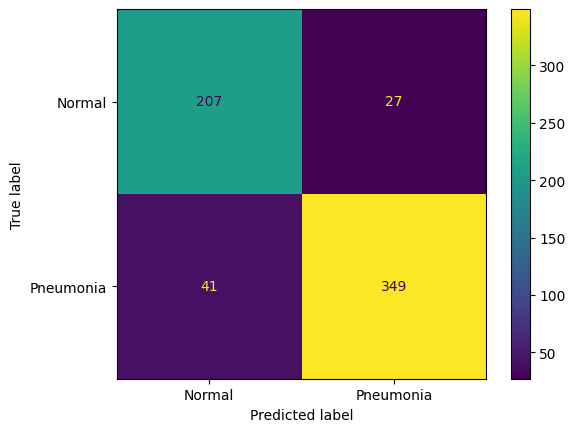

# Pneumonia Chest X-ray detection

A `Python` package to allow building and testing of a image classification model for the prediction of whether a patient has Pneumonia from their Chest X-ray. The dataset use was obtained from [Kaggle](https://www.kaggle.com/datasets/paultimothymooney/chest-xray-pneumonia)

## Quickstart details

Follow these steps to get started:
1. Clone the repository
2. Install the requirements.txt packages for development purposes (`pip install -r requirements.txt`)
3. Install the package `pip install -e .`

The notebooks assume the following directory structure for the datasets - a `data/` directory at the top level of the repo with sub-directories for `train`, `validation` and `test` and within those directories a `NORMAL/` and `PNEUMONIA/` folder with the corresponding image files. Here is an example folder structure where the normal train images are to be found:

`/data/chest_xray/train/NORMAL/`

## Package

The package is made up of five modules:

`preprocess.py` - contains classes/functions for preprocessing the input images.

`model.py` - defines the model architecture and some default parameters.

`train.py` - contains classes/functions for carrying out model training.

`training_run.py` - function to carry out model training. Training uses early stopping as defined by the user, with the best performing model on the validation set saved to the model directory. A `.json` file is also outputted to the model directory with the model parameters. Can be run from the command line.

`evaluate.py` - module for assessing model performance on a given test set. Provides accuracy, confusion matrix and classification report metrics. Can be run from command line.

## Notebooks

Three related notebooks are also provided:

`initial_eda.ipynb` - Carries out initial EDA on image samples.

`preprocess_train.ipynb` - steps through the process of preprocessing images and training a model using module functions.

`evaluate.ipynb` - goes through the process of evaluating a model using a test set and outputting various metric results.

## Command line examples

First move to the package directory:

`cd /workspaces/chest_xray_challenge/src/pneumonia_detector`

The following command is an example for training a model:

```python training_run.py --model_dir /workspaces/chest_xray_challenge/models/my_model --model_filename model.pt --training_dir /workspaces/chest_xray_challenge/data/chest_xray/train/ --validation_dir /workspaces/chest_xray_challenge/data/chest_xray/val/ --batch_size 16 --patience 5 --n_epochs 25```

This is an example to evaluate a model:

```python evaluate.py --model_dir ../../models/my_model/ --model_filename model.pt --test_dir ../../data/chest_xray/test/```

## Results

The above parameters yielded the following model performance on the provided test set:



## Possible future work

To improve model performance further optimization of model parameters could be explored.
An alternative approach that will likely lead to improved results is to fine tune a pre-training image classification model, such as ResNet, on the training data.
